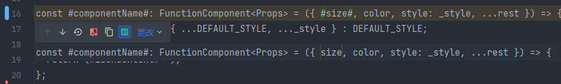
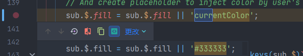

> 原介绍 https://github.com/iconfont-cli/react-iconfont-cli/blob/master/README.md

仅做以下部分修改

- 生成配置文件

  `npx iconfont-init`

  **注意** 需要额外在使用项目内安装开发依赖 `fs-extra`
- 开始生成 React 标准组件

  `npx iconfont-h5`

- `Warning:  Support for defaultProps will be removed from function components in a future major release.`
  - 需要修改
    - `src/templates/SingleIcon.tsx.template` （去除 Waring）
      
    - `src/libs/generateComponent.ts` （暂且作此处理：icon无颜色时可使用自定义颜色）
      
